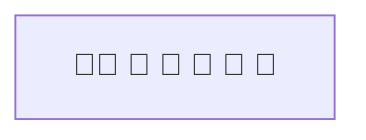
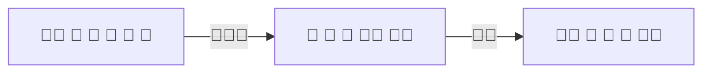
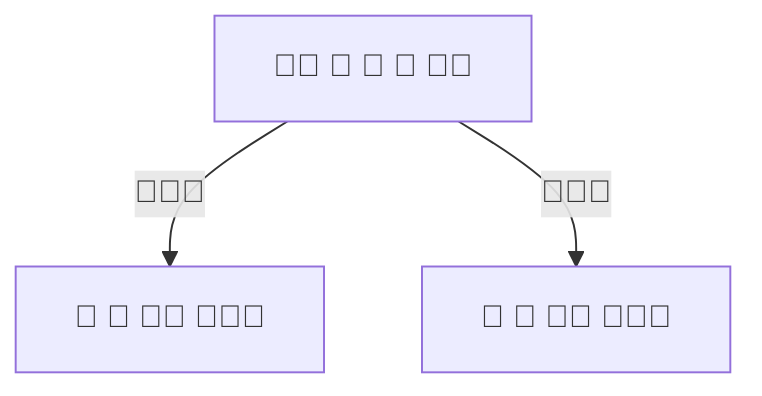
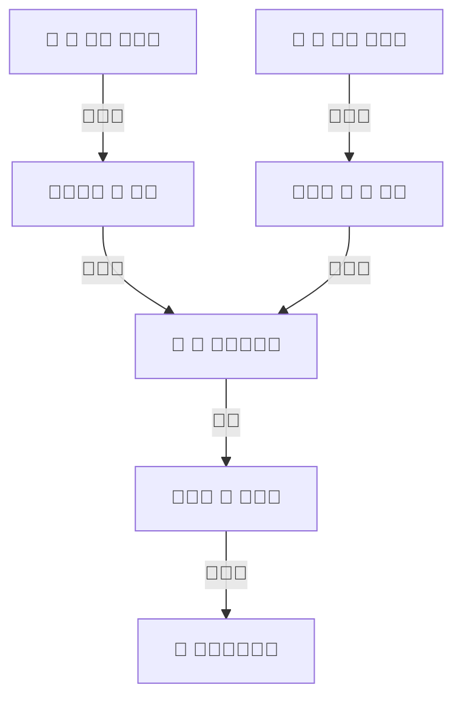
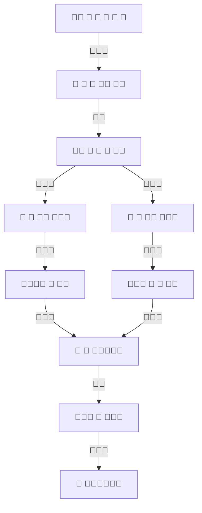
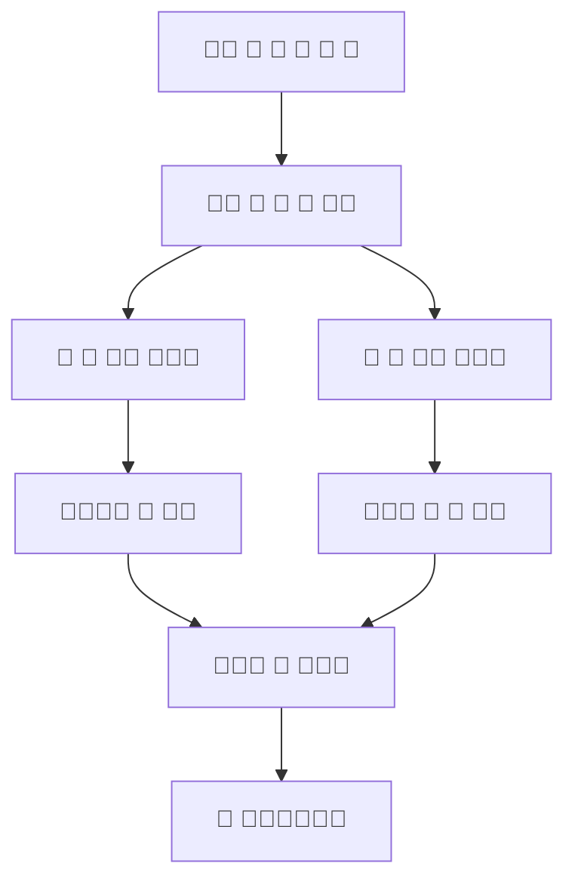

```text
⚠️ Cette page est encore en construction.
📣 N'hésitez pas à me faire parvenir vos commentaires.

Gautier
```

L'intelligence artificielle, ou IA, qu'est-ce que c'est?

L'intelligence artificielle c'est aujourd'hui beaucoup de choses, d'éléments, qui proviennent de domaines différents. De manière générale, c'est reproduire artificiellement, c'est-à-dire créée ou construite par l'humain une certaine forme d'intelligence.

Ce guide en "pente douce" aidera celles et ceux qui souhaitent découvrir l'intelliegence artificielle sans trop se casser la tête. Nous ne parlerons ici ni de programmation, ni trop de mathématiques, mais bien d'intelligence et à cette fin, rien de mieux que de commencer par un casse-tête. Car pour résoudre un casse-tête, c'est bien d'intelligence que nous avons besoin. Nous parlerons alors de raisonment, de logique, ou encore de déduction.


<br>


## Vous cassez-vous souvent le tête?

L'intelligence artificielle, c'est résoudre des casse-têtes.

Lorsque que l'on étudie l'intelligence artificielle, on commence généralement par un casse-tête.

En effet, on ne parle ni de programmation (bien que nous pouvons évidemment le programmer), ni de machine (bien que l'on en aura souvent besoin), mais bien de reproduire afin de comprendre l'intelligence et plus particulièrement l'intelligence humaine, bien que les animaux, les plantes et tous les systèmes vivant présentent certaine(s) forme(s) d'intelligence qui sont tout aussi intéressante(s) à reproduire et que nous, humains, reproduisons d'ailleur.

Commençons donc par un casse tête. Nous verrons ensuite les outils et les techniques que nous, humains, avons créés et développés afin de résoudre ces casse-têtes.


```markdown
Un paysan part en voyage avec un renard, une oie et un sac de haricots.
Il arrive face à une rivière qu'il doit traverser à l'aide d'un petit bateau qu'il trouve sur la berge.

Malheureusement, le bateau est trop petit pour acceuillir tous ce petit monde. Il ne peut faire traverser qu'un seul élément à la fois et ce avec deux contraintes: 

- si laissés ensemble, le renard mangera l'oie, 
- et de la même manière, l'oie mangera les haricots.

Comment faire?

```

### L'état initial: Conceptualiser

> En logique, un concept est un **contenu de pensée**, qui, lorsqu'il est appliqué à un objet, peut former une proposition. [...] Le concept est un terme abstrait qui se distingue donc de la chose désignée par ce concept. Le terme lui-même est introduit au Moyen Âge (conceptus) par Thomas d'Aquin [...]. Il vient du latin conceptus qui signifie « action de contenir, de tenir ensemble, de recevoir », dérivé du verbe concipere signifiant « concevoir ». - [Wikipedia](https://fr.wikipedia.org/wiki/Concept_(philosophie)){:target="_blank"} 

Comment faire plus abstrait? 🤔 

Nous retiendrons que conceptualiser, c'est **définir un contenu de pensée**. 

Un paysan 🧑‍🌾, accompagné d'un renard 🦊, d'une oie 🪿, et d'un sac de haricots 🫘	se retrouve face à une rivière 🛶.




### La première étape: Schématiser

> Le schéma du grec ancien σχῆμα / skhễma (« manière d'être », « forme », « figure », « extérieur », « apparence », « faux-semblant ») est une **représentation** de données **simplifiée** servant de vecteur de communication et souvent **codifié ou symbolisé**. Le mot prend généralement le sens de graphe selon le domaine dont on parle [...] - [Wikipedia](https://fr.wikipedia.org/wiki/Sch%C3%A9ma){:target="_blank"}

On parle en général d'une représentation graphique simplifiée, mais c'est aussi:

- un **objet** de la géométrie algébrique en mathématiques
- une **structure** de l'information en informatique
- un certain type de **représentations mentales** en psychologie
- etc.

Face à la rivière, notre voyageur ne peut laisser seul ni le renard avec l'oie, ni l'oie avec le sac de haricots.



### La deuxième étape: le choix

Ici vient un choix qui, au final, n'aura pas d'incidence sur le résultat.



Découvrons un peu plus à ce qu'est ou ce que représente réellement un choix.

> Un choix résulte de la **décision** d'un **individu ou d'un groupe** confronté à une **situation ou à un système** offrant une ou plusieurs options. Le terme « choix » pouvant désigner le **processus** par lequel cette opération est menée à bien et/ou le **résultat** de ladite opération. - [Wikipedia](https://fr.wikipedia.org/wiki/Choix){:target="_blank"}

Nous pouvons ici nous intéresser aux différents éléments que compose cette définition:

- L'intelligence artificielle, c'est prendre des décisions, ou tout simplement prend des décisions.
- Un individu ou un groupe d'invidu, nous appelons ça en intelligence artificielle un ou des agents intelligents.
- L'intelligence artificielle désigne à la fois un processus et son résultat.

A noter aussi que sans différentes options qui se présentent à nous, nous n'avons pas de choix.

### Le déroulement

Une foix notre choix effectué, la solution ne reste plus qu'à être déroulée.



En intelligence artificielle, nous travaillons la conceptualisation, la schématisation, l'analyse et la synthèse. Nous développerons ces deux derniers dans la section suivante.


## Le schéma complet

Visualiser le schéma dans son ensemble nous permet de se rendre compte de quelques spécificités présentes dans notre problème.



- Le paysan effectuera toujours deux trajets seul, le deuxième et l'avant-dernier trajet, il n'en est pas possible autrement.
- L'étape centrale sera toujours, dans tous les cas, un trajet avec l'oie. Celle-ci est en effet le coeur du problème.

**Le schéma simplifié**


Nous pouvons simplier le schéma, car au final, ce qui nous intéresse, ce sont les différents états dans lequel nous nous trouvons à chaque instant.



## Récapitulons

L'intelligence artificielle:

- résoud des casse-têtes et prend des décisions,
- c'est résoudre des casse-têtes et prendre des décisions,
- représente à la fois un **processus** et son **résultat**.

Un agent intelligent est tout individu ou groupe d'individu confronté à un problème.

En intelligence artificielle, nous étudions et travaillons:

- la **conceptualisation**: définir un contenu de pensée.
- la **schématisation**: représentation simplifié, codifiée ou symbolisée.
- l'**analyse**: déduire ou détecter des "vérités".
- la **synthèse**: définir un problème, déterminer de quoi avons nous réellement besoin, quelles sont nos contraintes et nos solutions.

