L'intelligence artificielle, ou IA, qu'est-ce que c'est?

L'intelligence artificielle c'est aujourd'hui beaucoup de choses, d'éléments, qui proviennent de domaines différents et variés qui ensemble forment l'IA d'aujourd'hui. 

Si vous ne l'avez pas encore fait, je vous invite à lire [l'histoire de l'intelligence artificielle](/ai-history/). 

De manière générale, c'est **reproduire** artificiellement, c'est-à-dire créer ou construire (nous les humains) une certaine forme d'**intelligence**.

<!-- Ce guide en "pente douce" aidera celles et ceux qui souhaitent découvrir l'intelliegence artificielle sans trop se casser la tête. -->

Nous ne parlerons ici ni de programmation, ni de mathématiques, mais bien d'intelligence et à cette fin, nous passerons rapidement, après avoir rappelé ce que nous définissons être l'intelligence, à un exercice de mise en pratique de l'intelligence, un **problème**.

<!-- Car pour résoudre un casse-tête, c'est bien d'intelligence que nous avons besoin. Nous parlerons alors de raisonment, de logique, ou encore de déduction. -->

Mais d'abord, rappelons ce qu'est cette intelligence que nous voulons automatiser.

> L'intelligence est l'**ensemble des processus** trouvés dans des systèmes, plus ou moins complexes, vivants ou non, qui permettent d'**apprendre**, de **comprendre** ou de **s'adapter** à des **situations nouvelles**. - [Wikipedia](https://fr.wikipedia.org/wiki/Intelligence){:target="_blank"}

Nous allons ici découvrir quels processus permettent d'apprendre, de comprendre et de s'adapter.

Nous ne parlerons ici ni de programmation (bien que nous pouvons évidemment le programmer), ni de machine (bien que l'on en aura souvent besoin), mais bien de reproduire afin de comprendre l'intelligence et plus particulièrement l'intelligence humaine, bien que les animaux, les plantes et tous les systèmes vivant présentent certaine(s) forme(s) d'intelligence qui sont tout aussi intéressante(s) à reproduire et que nous, humains, reproduisons d'ailleur.

Commençons par un problème.

## Un Problème

L'intelligence artificielle, c'est résoudre des problèmes, que l'on appelle parfois casse-tête.

<!-- Lorsque que l'on étudie l'intelligence artificielle, on commence généralement par un casse-tête. -->

Commençons donc par un casse tête. Nous verrons ensuite les outils et les techniques que nous, humains mais aussi êtres vivants, avons créés et développés afin de résoudre les problèmes que nous rencontrons.


```markdown
Un paysan part en voyage avec un renard, une oie et un sac de haricots.
Il arrive face à une rivière qu'il doit traverser à l'aide d'un petit bateau qu'il trouve sur la berge.

Malheureusement, le bateau est trop petit pour acceuillir tous ce petit monde. Il ne peut faire traverser qu'un seul élément à la fois et ce avec deux contraintes: 

- si laissés ensemble, le renard mangera l'oie, 
- et de la même manière, l'oie mangera les haricots.

Comment faire?

```

---

<br>

Avant de nous attaquez à comment faire pour résoudre un problème, 
nous commençons par voir ce qu'est un problème et comment le définit-on.
Nous verrons que dans la pratique, résoudre un problème commencera, et consistera, toujours par sa définition.

> Un problème [...] est **une situation** dans laquelle un **obstacle** empêche de **progresser**, d'**avancer** ou de **réaliser** ce que l'on voulait faire. Un problème naît lorsqu'il y a une **différence entre l'état des choses et celui souhaité**, ou lorsqu'il y a anormalité, c'est le cas en industrie ou en physiologie. - [Wikipedia](https://fr.wikipedia.org/wiki/Probl%C3%A8me){:target="_blank"} 

La représentation que nous pouvons faire ici ressemble étrangement à la représentation faite d'un système expert dans [L'Histoire de l'Intelligence Artificielle](/ai-history/). Les systèmes experts ayant pour but de résoudre un (et un seul) problème, c'est finalement logique.

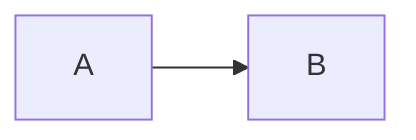

A est ici une *situation* ou l'*état des choses* et B l'*Etat souhaité* ou *résultat*.
Avec cependant, un obstacle entre les deux.

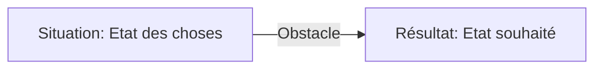

<!-- Maintenant que nous avons une idée plus précise de ce qu'est un problème, nous pouvons passer à la résolution.
Comme dit précedement, la résolution d'un problème commence toujours par sa définition. -->

Revenons à notre problème et tentons de le définir.

<!-- > En logique, un concept est un **contenu de pensée**, qui, lorsqu'il est appliqué à un objet, peut former une proposition. [...] Le concept est un terme abstrait qui se distingue donc de la chose désignée par ce concept. Le terme lui-même est introduit au Moyen Âge (conceptus) par Thomas d'Aquin [...]. Il vient du latin conceptus qui signifie « action de contenir, de tenir ensemble, de recevoir », dérivé du verbe concipere signifiant « concevoir ». - [Wikipedia](https://fr.wikipedia.org/wiki/Concept_(philosophie)){:target="_blank"} 

Comment faire plus abstrait? 🤔 

Nous retiendrons que conceptualiser, c'est **définir un contenu de pensée**. 
 -->

Voici, dans la fenêtre de gauche, notre **état initial**: un paysan 🧑‍🌾, accompagné d'un renard 🦊, d'une oie 🪿, et d'un sac de haricots 🫘 se retrouve face à une rivière 🛶. Et dans la fenêtre de droite, l'**état souhaité**.

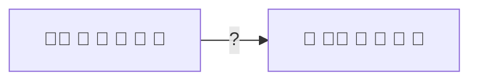

Nous savons déjà, car décrit dans l'énoncé du problème que le renard ne peut être laissé seul avec l'oie et que l'oie ne peut être laissée seule avec les haricots.

Ici nous recevons dans l'énnoncé les règles que nous devons suivre mais dans la nature, les problèmes peuvent se présenter de manière plus ou moins explicite que cela. **Que devrions-nous faire si nous ne connaissions pas ces règles?**

Ici se pose, à peu près toujours, la question "**que connaissons nous vraiment du problème?**"
<!-- Nous ne détectons d'ailleurs pas toujours les problèmes qui nous entourent. -->

Il s'agirat alors de passer par des essais et des erreurs afin de se rendre compte de la réalité du problème, ou la situation, et ensuite d'en apercevoir les résultats possibles, que nous jugerons "souhaités" ou pas.

C'est un des principes majeurs de l'Apprentissage Automatique de machines(Machine Learning en anglais), et c'est aussi tout simplement un des processus les plus utiles pour **apprendre**.

<!-- Mais avant de passer à l'essais/erreurs, commençons par définir et plus encovre, conceptualiser, les éléments de notre problème. -->

## Apprendre 

> **Acquérir** une **connaissance** [...]. - [Wiktionary](https://fr.wiktionary.org/wiki/apprendre){:target="_blank"}

Comme évoqué précedemment, nous reçevons explicitement dans notre problème une série de règles: 
ne pas laisser le renard et l'oie seuls et ne pas laisser l'oie et les haricots seuls.

Mais que ce passerait-il si nous ne connaissions pas ces règles? Il nous faudrait alors les déterminer. Le processus en question réunnit les essais et et les erreurs.

- **Essai n°1**: je prend le renard avec moi de l'autre côté de la rivière.
- **Résultat**: l'oie mange les haricots.

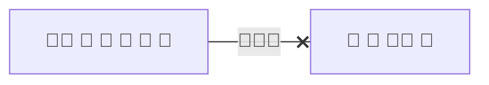

L'état obtenu n'est pas celui que nous souhaitons car les petits pois ont disparu dans la fenêtre de droite.

Nous apprenons, ou renforçons l'idée, que l'oie ne peut être laissée seule avec les petits pois.
La règle équivalente entre le renard et l'oie serait apprise si l'on commençait avec les petits pois.

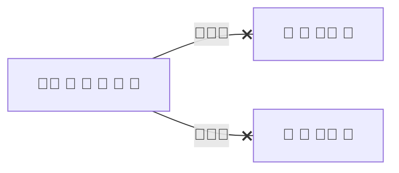

Si l'on continue, nous saisissons qu'en commençant avec l'oie, l'état obtenu est acceptable car tous les éléments sont encore là, et que nous pouvons donc continuer, aller plus loin, dans la résolution de notre problème.

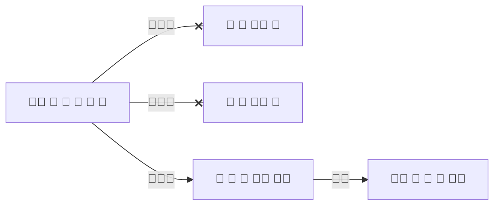
Ici, nous saisissons que la seule possibilité au départ, c'est de commencer avec l'oie. Saisir une connaissance, ou un sens, c'est **comprendre**.

## Comprendre

> Saisir le **sens** [...], se faire une **juste idée** [...] de quelque chose - [Wiktionary](https://fr.wiktionary.org/wiki/comprendre)

<!-- 
> Le schéma du grec ancien σχῆμα / skhễma (« manière d'être », « forme », « figure », « extérieur », « apparence », « faux-semblant ») est une **représentation** de données **simplifiée** servant de vecteur de communication et souvent **codifié ou symbolisé**. Le mot prend généralement le sens de graphe selon le domaine dont on parle [...] - [Wikipedia](https://fr.wikipedia.org/wiki/Sch%C3%A9ma){:target="_blank"}

On parle en général d'une représentation graphique simplifiée, mais c'est aussi:

- un **objet** de la géométrie algébrique en mathématiques
- une **structure** de l'information en informatique
- un certain type de **représentations mentales** en psychologie
- etc.
 -->

Nous pouvons déduire que face à la rivière, notre voyageur ne pouvant laisser seul ni le renard avec l'oie, ni l'oie avec le sac de haricots,
la seule possibilité qui reste est bien de commencer avec l'oie.

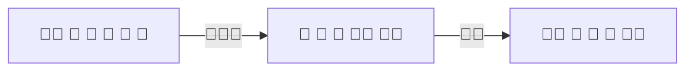

Pour aller plus loin à partir d'ici, il nous faudra apprendre ou comprendre que la seule manière d'atteindre notre état souhaité, c'est de revenir avec des éléments afin que ceux-ci ne se mange pas entre eux.

Une fois que nous avons appris ou compris cela, notre problème devient tout de suite plus facile.

<!-- Vient ensuite un autre élément important de la résolution de problème et de l'intelligence, la prise de **décision**. -->

Ici nous avons un choix qui s'offre à nous, mais qui au final, n'aura pas réellement d'incidence sur le résultat.

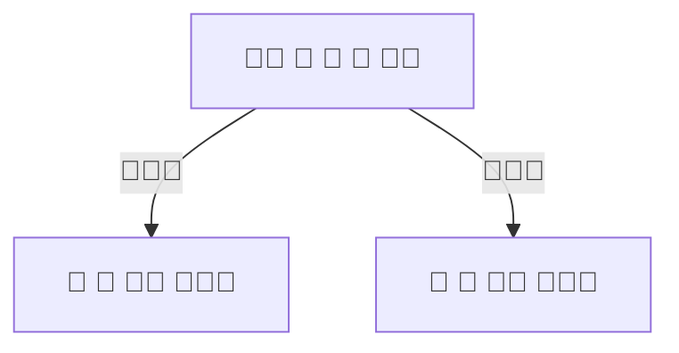

<!-- Découvrons un peu plus à ce qu'est ou ce que représente réellement un choix.

> Un choix résulte de la **décision** d'un **individu ou d'un groupe** confronté à une **situation ou à un système** offrant une ou plusieurs options. Le terme « choix » pouvant désigner le **processus** par lequel cette opération est menée à bien et/ou le **résultat** de ladite opération. - [Wikipedia](https://fr.wikipedia.org/wiki/Choix){:target="_blank"}

Nous pouvons ici nous intéresser aux différents éléments que compose cette définition:

- L'intelligence artificielle, c'est prendre des décisions, ou tout simplement prend des décisions.
- Un individu ou un groupe d'invidu, nous appelons ça en intelligence artificielle un ou des agents intelligents. -->

<!-- - L'intelligence artificielle désigne à la fois un processus et son résultat. -->

<!-- A noter aussi que sans différentes options qui se présentent à nous, nous n'avons pas de choix. -->

<!-- ### L'Action -->

Une foix notre choix effectué, la solution ne reste plus qu'à être déroulée.

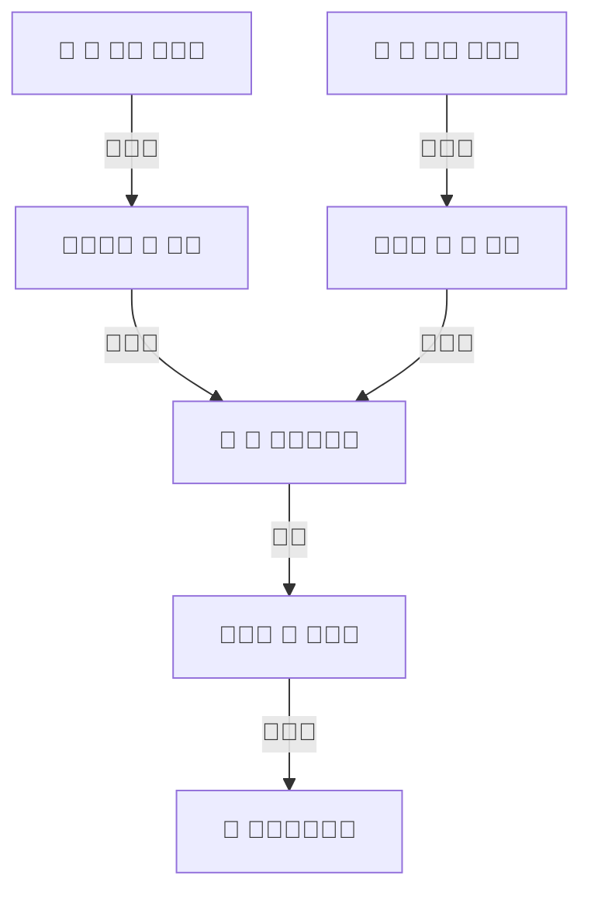

<!-- En intelligence artificielle, nous travaillons la conceptualisation, la schématisation, l'analyse et la synthèse. Nous développerons ces deux derniers dans la section suivante. -->


<!-- ## Le schéma complet

Visualiser le schéma dans son ensemble nous permet de se rendre compte de quelques spécificités présentes dans notre problème.

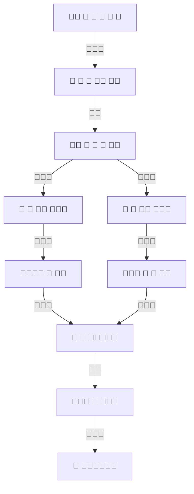

- Le paysan effectuera toujours deux trajets seul, le deuxième et l'avant-dernier trajet, il n'en est pas possible autrement.
- L'étape centrale sera toujours, dans tous les cas, un trajet avec l'oie. Celle-ci est en effet le coeur du problème.

**Le schéma simplifié**


Nous pouvons simplier le schéma, car au final, ce qui nous intéresse, ce sont les différents états dans lequel nous nous trouvons à chaque instant.

-->
<!--
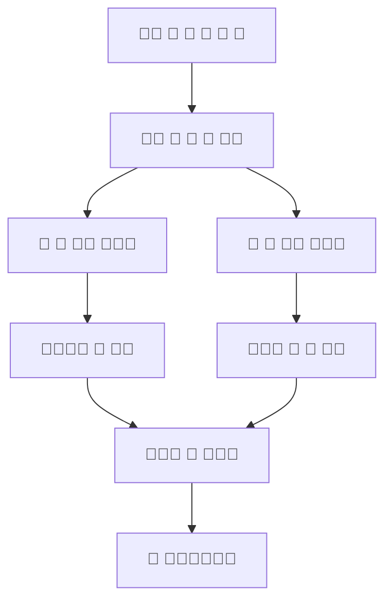
-->
## Récapitulons

L'intelligence artificielle, ou l'intelligence tout court:

- c'est résoudre des problème
- c'est apprendre, comprendre et s'adapter
- représente donc à la fois un **processus** (apprendre) et son **résultat** (comprendre).

<!-- Un agent intelligent est tout individu ou groupe d'individu confronté à un problème.

En intelligence artificielle, nous étudions et travaillons:

- la **conceptualisation**: définir un contenu de pensée.
- la **schématisation**: représentation simplifié, codifiée ou symbolisée.
- l'**analyse**: déduire ou détecter des "vérités".
- la **synthèse**: définir un problème, déterminer de quoi avons nous réellement besoin, quelles sont nos contraintes et nos solutions.
 -->

<!-- ---
Aller plus loin:

- apprendre vs. comprendre
- conceptualiser et shématiser
- abre de décision ou de connaissances
--- -->