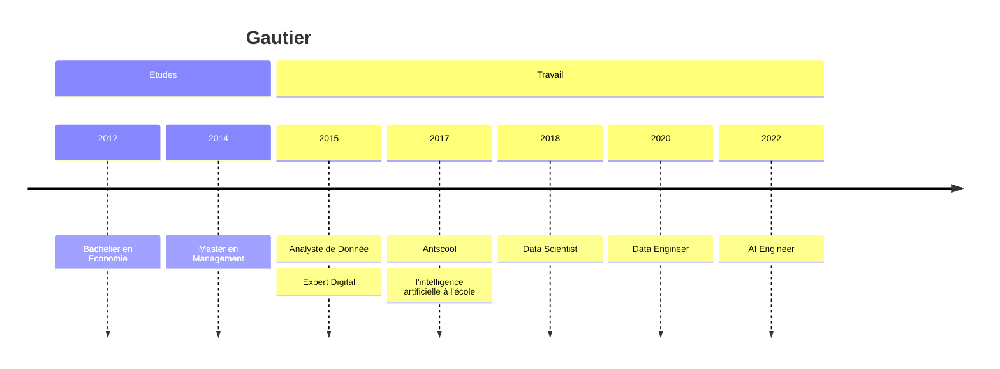

## Economiste le jour, Programmeur la nuit

Entre 2015 et 2017, je travaille en tant qu'analyste de donnée, expert du digital, dans le départment économie d'une association européenne à Bruxelles.

Je passe mes journée à collecter, néttoyer, analyser et présenter des données.

Je passe mon temps libre à apprendre Python et à créer de tout et n'importe quoi, de jeux vidéos à des robots qui scrute le web pour moi.

J'ai appris à l'école les statistiques et l'algèbre linéaire, j'apprends maintenant l'ingénieurie logicielle et le développement d'application grâce à la programmation.

### La rencontre avec Montessori

En 2017, je rencontre une école Montessori de Bruxelles et fonde l'association Antscool afin de structurer les projets développés durant mon temps libre.

## Le Data Science et l'Intelligence Artificielle

