De 1950 à nos jours, le terme Intelligence Artificielle a évolué de *machine à réfléchir* à *machine à tout connaître*.

Avant toute chose, l'intelligence c'est quoi?

> L'intelligence est l'**ensemble des processus** trouvés dans des systèmes, plus ou moins complexes, vivants ou non, qui permettent d'**apprendre**, de **comprendre** ou de **s'adapter** à des **situations nouvelles**. - [Wikipedia](https://fr.wikipedia.org/wiki/Intelligence){:target="_blank"}

Le terme est emprunté au latin *intellĕgentĭa*, lui-même dérivé du latin *intellĕgō* et qui signifie « discerner, démêler, comprendre, remarquer ».

L'intelligence est un concept encore souvent mal défini. Nous retiendrons ici qu'être intelligent, c'est donc être capable de s'adapter à une situation nouvelle. L'intelligence se distingue de la pensée et des connaissances, nous y reviendrons.


## Alan Turing, l'Expérience de Pensée et le Test de Turing

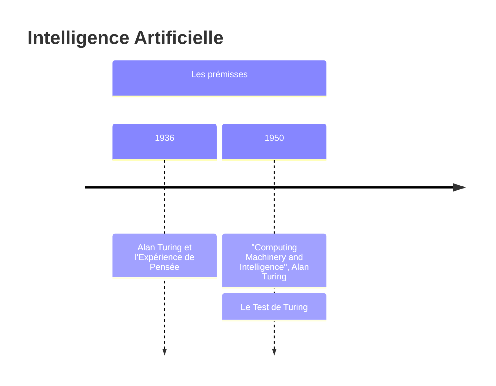

> Une **expérience de pensée**, expérience par la pensée, expérience mentale ou expérience en imagination, est une **méthode qui permet de résoudre un problème** en utilisant la seule puissance de l'imagination humaine. - [Wikipedia](https://fr.wikipedia.org/wiki/Exp%C3%A9rience_de_pens%C3%A9e){:target='_blank'}


L'intelligence selon Turing, c'est résoudre un problème. Nous y reviendrons à la fin de cet article. 
La question qu'il pose: "**Les machines peuvent-elles penser ?**"

Le test de Turing consiste à mettre un humain en confrontation verbale à l’aveugle avec un ordinateur et un autre humain. 
Si la personne qui engage les conversations n’est pas capable de dire lequel de ses interlocuteurs est un ordinateur, on peut considérer que le logiciel de l’ordinateur a passé avec succès le test.

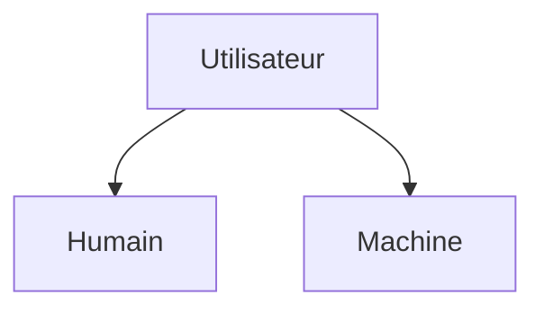

Alors, bien que certainement visionnaire, les premiers outils dit intelligents et réellement utiles à la société ne passait pas ce teste. En effet, les premières machines "intelligentes" ne sont autre que des systèmes experts.

## Les Systèmes Experts

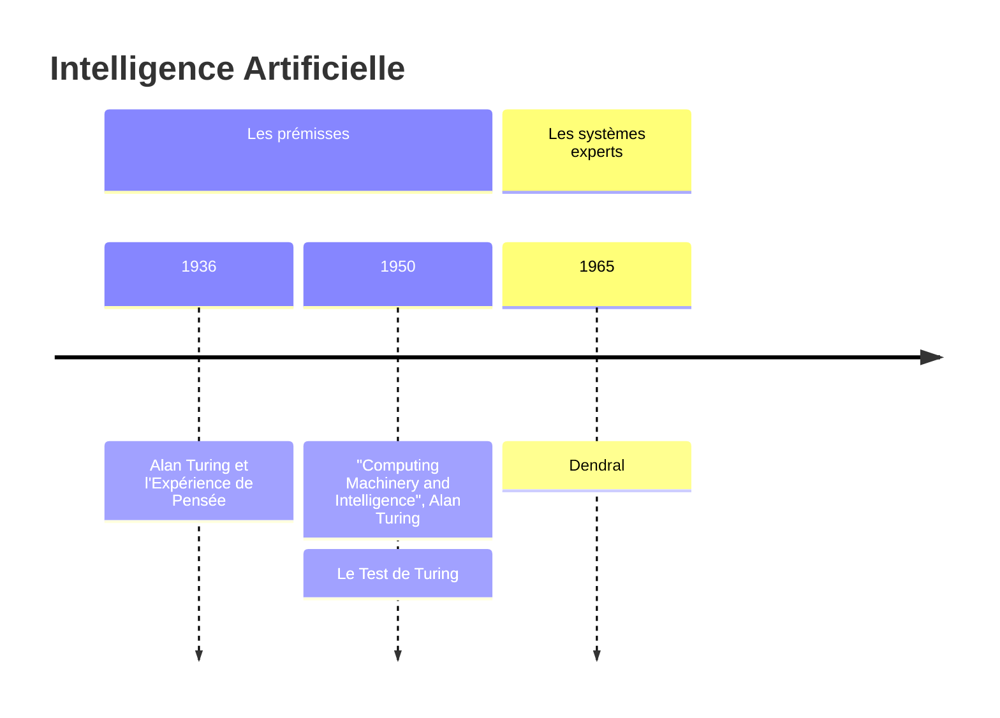

Un **système expert**, un outil capable de reproduire les mécanismes cognitifs d'un expert, dans un domaine particulier.

[Dendral](https://en.wikipedia.org/wiki/Dendral){:target="_blank"}, par exemple, est un système expert qui avait pour but d'aider des chimistes organiques à identifier des molécules chimiques inconnues en analysant leur masse et en utilisant des connaissances en chimie.

De manière générale, un système expert consiste à déterminer un certains nombre de règles à partir de faits, et d'ensuite déterminer ou prédire de nouveaux faits.

On utilise pour cela:

- une base de faits: des connaissances
- une base de règles: des principes ou "lois"
- un moteur d'inférence: des raisonnements déductifs


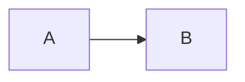

Si A est vrai (fait ou prémisse) et que A implique B, alors B est vrai (nouveau fait ou conclusion.)

---

Creusez un peu plus: [Système expert](https://fr.wikipedia.org/wiki/Syst%C3%A8me_expert){:target="_blank"}

---

Des sytèmes experts, il y en aura beaucoup d'autres qui apparaîtront par la suite,

- en 2017: DeepBlue, la première machine à battre le champion aux échecs,
- en 2012: AlphaGo,  la première machine à battre le champion au jeu de Go,

qui sont ici des sytèmes encore "fermé" dans le sens ou les règles sont prédéfinies.

Les capacités (extrèmes) des machines sont atteintes principalement grâce aux avancées techniques computationnelles. Nous atteinons des sommets plus hauts car nos machines sont plus puissantes.

Pour vous donnez une petite idée de la complexité de ces jeux, voici quelques chiffres qui les décrivant:

| | Echecs | GO |
 Nombre de positions | 10^50 | 10^170 |
 Nombre de parties | 10^120 | 10^600 |


Mais la première "machine" qui passera le teste de Turing, bien avant cela, c'est ELIZA, le premier chatbot.

### ELIZA: Le premier Chatbot

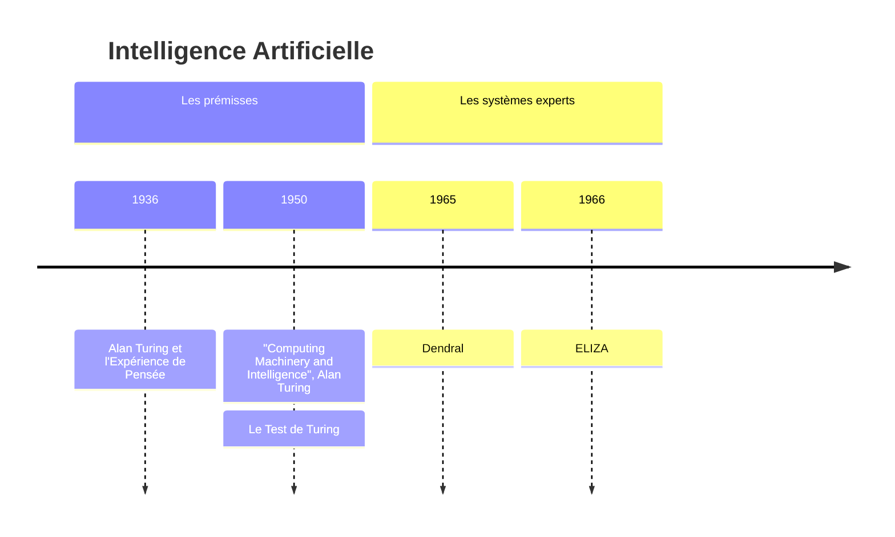

ELIZA a été le premier chatbot au monde, développé entre 1964 et 1966 par le professeur Joseph Weizenbaum du Massachusetts Institute of Technology (MIT). 
À l'époque, le programme informatique faisait preuve d'une empathie donnant l'illusion d'une conversation humaine.

ELIZA joue le rôle d'un psychothérapeute rogérien.

```
ÈLIZA: Quelque chose vous préocupe-t-il?
YOU: Le monde ne semble pas tourner rond.
ELIZA: Quel sentiment vous procure-t-il le fait que le monde ne semble pas tourner rond?
YOU: La peur
ELIZA: Comment ressentez-vous la peur?
```

Le principe est ici simplement de renvoyer les dires de l'utilisateur. Celui-ci dit *A*, la machine répond: *Que pensez-vous de A?* 
Nous verrons plus loin qu'il ne s'agit en réalité que d'un traitement spécifique et pré-déterminé de la machine. 
Nous sommes, en effet, encore loin d'une machine réellement capable de penser.

---

En découvrir plus: [Eliza (Wikipedia)](https://fr.wikipedia.org/wiki/ELIZA)

---

## L'Apprentissage Machine ou Automatisé

Machine Learning en anglais, le terme est conceptualisé pour la première fois en 1950, mais c'est bien dans les années 1980 que la technique apparaît réellement et dans les années 1990 et après qu'elle prendra son essor.


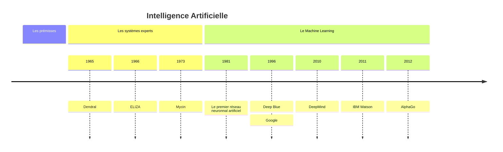

Il s'agit maintenant d'algorithmes statistiques en opposition au systèmes experts qui étaient de type heuristique.

La machine apprend d'elle-même grâce aux statistiques qu'elle peut calculer sur base de données existantes.

Nous décelons à cette époque différentes branches de l'intelligence artificielle qui émergent; l'apprentissage automatisé qui se détache des systèmes experts, ainsi qu'un problème sociétal qui apparaît avec **internet**, plus spécifiquement **le web** (commercial) et les moteurs de recherche.

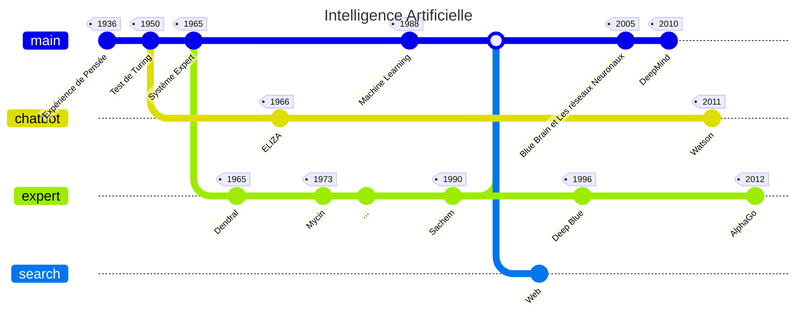

Bien que nous voyons des avancées fulgurantes en termes d'avancées technologique et scientifique, il faudra attendre entre 20 et 30 ans avant de voir une révolution dans le monde de l'intelligence artificielle, l'IA générative.

## L'IA Générative

L'intelligence Artificielle Générative, c'est l'intelligence capable de générer quelque chose, du contenu, que ce soit du texte, de l'image ou de la musique.
Nous nous intéresserons ici principalement aux modèles de language, c'est-à-dire les modèles basés sur du texte.

Nous commençons tout de suite avec les "Grand modèle de language".

### Grands modèles de Langage

C'est en 2017 qu'est proposé par des ingénieurs de chez Google le premier modèle de transformeur, qui fondera les bases des **grands modèles de langage** (grand modèle linguistique, grand modèle de langue, modèle de langage de grande taille ou encore modèle massif de langage) abrégé **LLM** de l'anglais *large language model*.


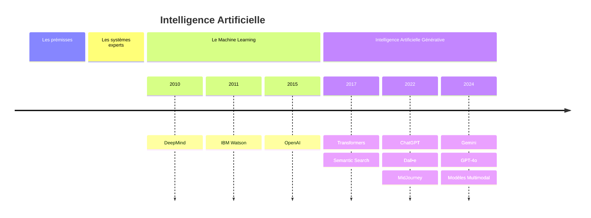

Les LLM sont la continuité d'une branche spécifique de l'intelligence artificielle, le traitement de langage naturel, abrégé **NLP** pour natural language processing en anglais.

Il ont pour vocation de traiter du texte afin de créer une représentation de ce texte en se basant sur un réseau neuronnal profond, Deep Neural Network en anglais.


### Traitement du Langage Naturel

L'histoire du NLP remonte à plus de cent ans maintenant avec un linguiste suisse, professeur de l'université de Genève, Ferdinand de Saussure, qui créat au début du 20 ème siècle, un "Cours de linguistique générale", publié par ses élèves après sa mort (trois ans plus tôt) en 1916.

Mais ce n'est que dans les années 1950 que la recherche et les travaux aboutiront réellement avec Noam Chomsky qui publia "Syntactic Structures" en 1957 dans lequel il décrit une méthode qui consiste à traduire des phrases de language naturel dans un format utilisable par un ordinateur. En 1958, un premier language de programmation LISP est créé par John McCarthy.

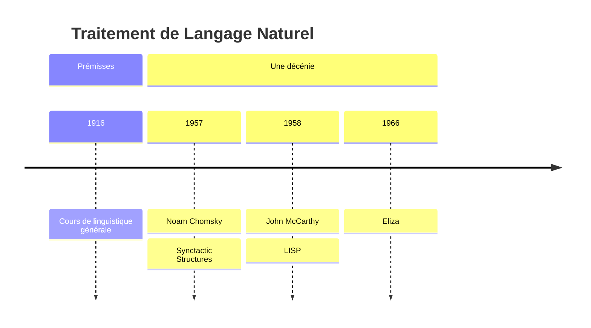

Nous voyons apparaître au cours d'une décénie: une **méthode**, un **langage** et une **application**.

Eliza est donc en réalité une experte en traitement de langage naturel, rien de plus. Elle (n')est capable (que) de manipuler du texte.

---

Creusez un peu plus:

- [Ferdinand de Saussure](https://fr.wikipedia.org/wiki/Ferdinand_de_Saussure){:target="_blank"}

---

## Vue d'ensemble

L'évolution ne s'est pas faite de manière linéaire. En effet, différentes branches de l'intelligence artificielle ont poussé dans différentes directions.


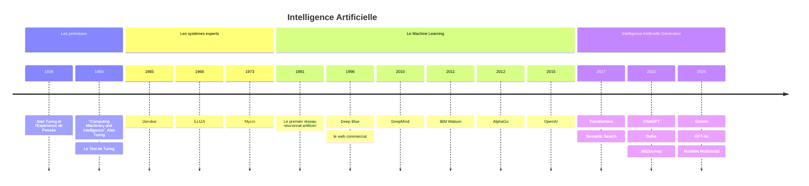

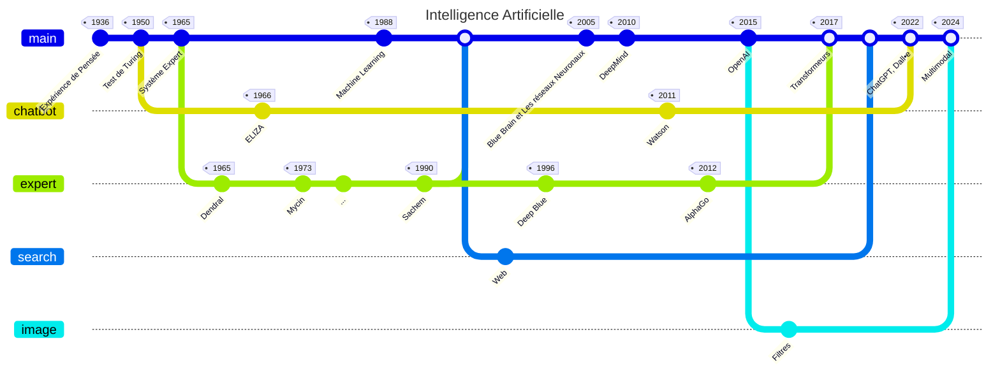

Les avancées atteintes récemment sont impressionnantes car nous arrivons à l'aboutissement de différentes branches dans un tronc commun réunnissant le language et l'image, après tout, lorsque nous écrivons, nous dessinnons. 

Nous pourrions affirmer que les chatbots que nous connaissons aujourd'hui sont, grâce à l'apprentissage automatique, des experts du language.

## Esprit Critique

Mais alors, comment se distingue l'IA d'aujourd'hui de celle d'il y a trente ans?

- Comment détermine-t-on que quelquechose est vrai?
- Comment détermine-t-on que l'on sait quelquechose?
- Une phrase ou un texte peuvent être grammaticalement corrects, avoir un sens ou même plusieurs, mais comment déterminer si le sens est correct?
- Parler à un LLM, est-ce faire une recherche?
- Comment évaluer une recherche et son résultat?
- Comment déterminer si une information est correcte?
